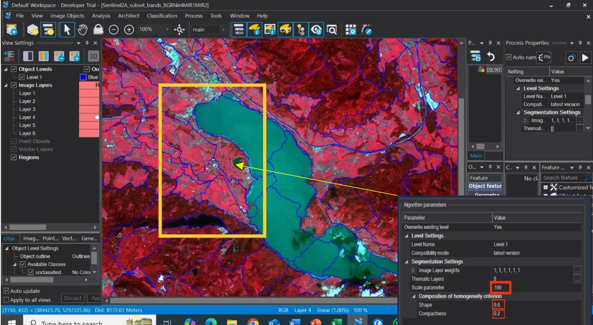
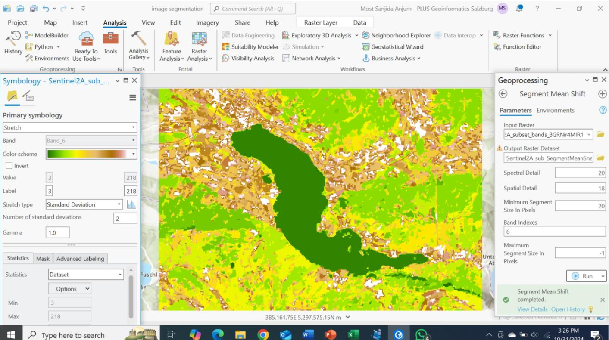
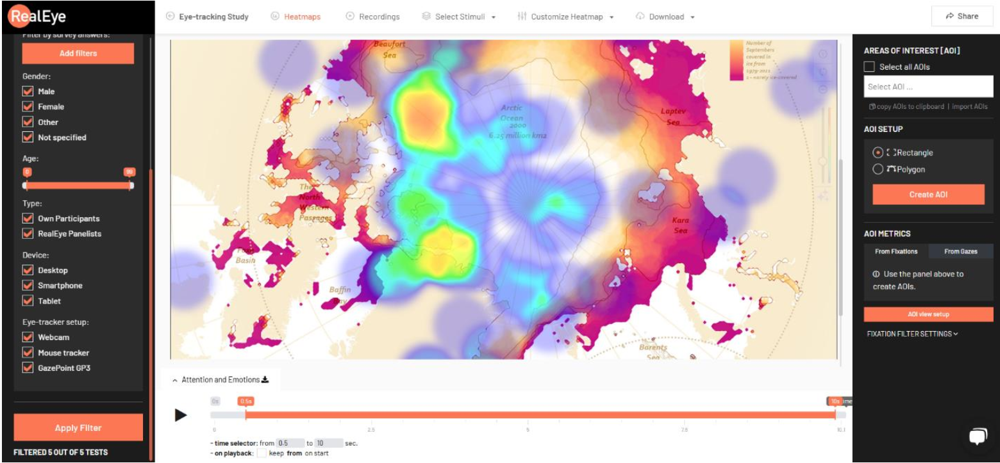
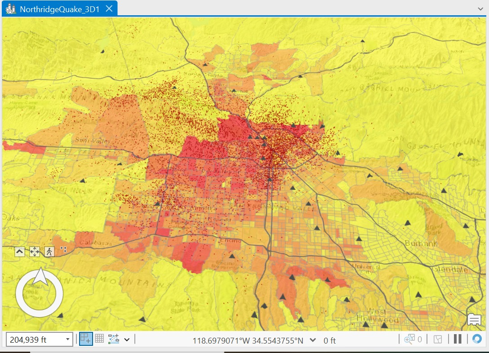
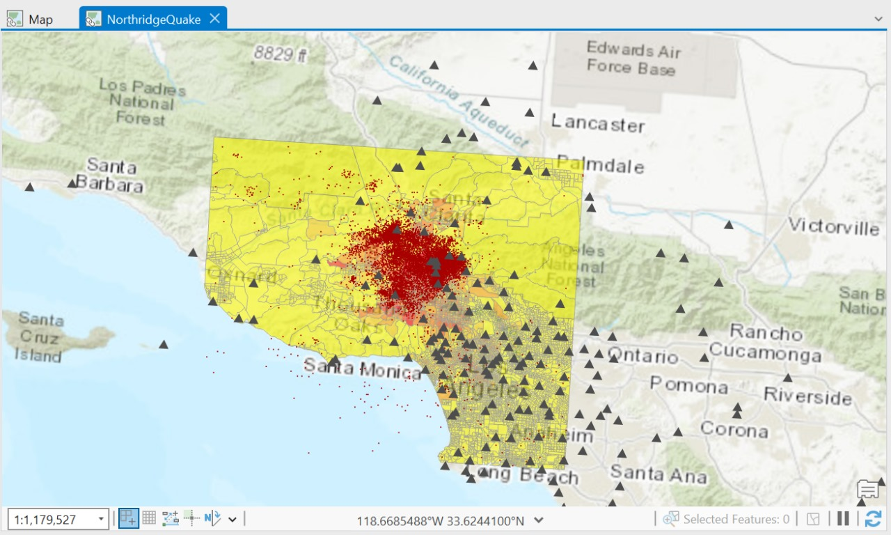
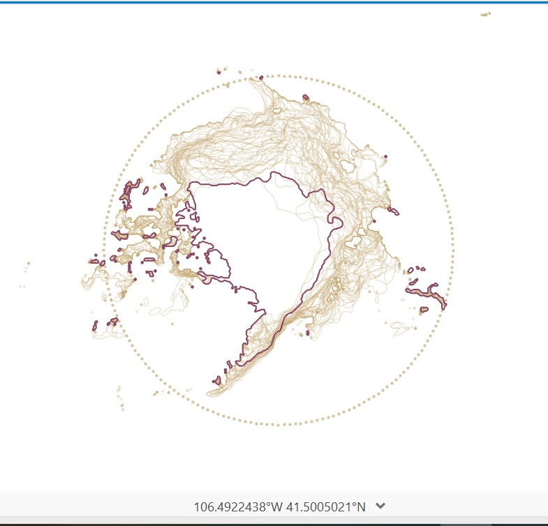
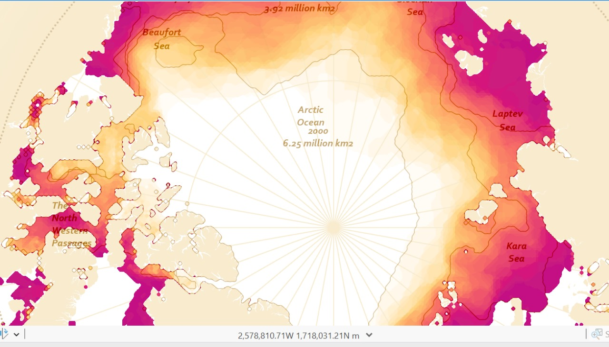
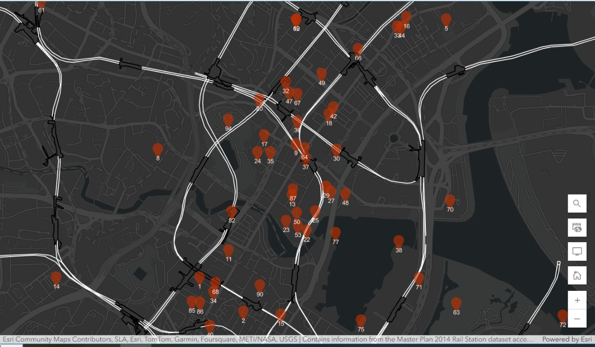
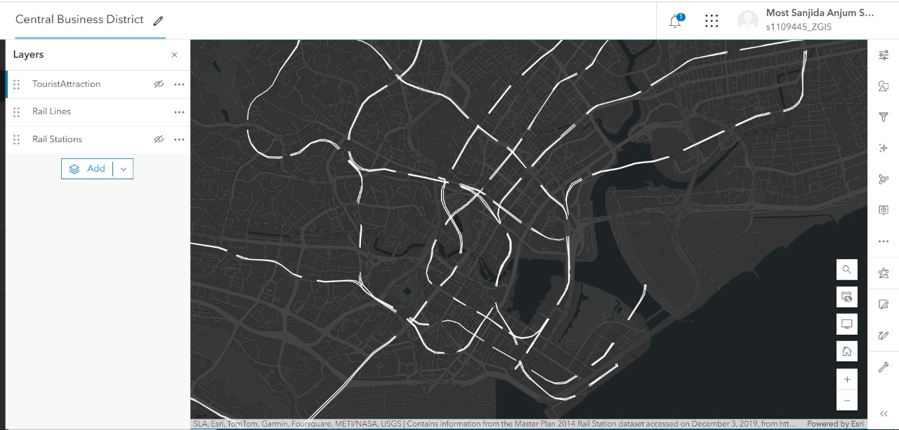

**Image segmentation using eCognition** 

Image segmentation is a core computer vision task that divides the image into several objects or important parts. The new challenge here is to reconstruct images by exploding them into simpler parts so that they can be produced and understood. Image segmentation in ArcGIS Pro, or eCognition: ArcGIS Pro has an extra extension called the Spatial Analyst where it can have some pixel image analysis capabilities for either segmentation or classification processes, and object-oriented ones as well so no need to separately run things.In contrast, eCognition has better segmentation and feature extraction capabilities designed specifically for object-oriented image analysis (OBIA). Even however ArcGIS Pro supplies a whole GIS environment, eCognition is more suitable since it has comprehensive graphic analysis and
segmentation capabilities. Based on the level of information you need in your segmentation results, complexity of images and requirements for specific project will define which option works for you. In this report with sentinel 2 image, I am going to make a comparison between eCognition and arcgis pro and can see what differences it will make and give a better image object.

Figure 1: Image segmentation using eCognition

Figure 2: Image segmentation using Arcgis Pro

eCognition:
For ecogntion, even after adjusting the parameters, the algorithm is still not detecting correctly the areas 
- The lake as being significantly over-segmented, into several segmentation regions. 
- The borders between segments, especially in hilly areas are not quite as well defined and sometimes jagged. 
Arcgis Pro: 
-The regionalization algorithm under-segments in some areas, combining regions should be kept separate. 
- it can detect those areas in somehow correctly like the lake so to conclude that both softwaresdemands manual adjustment for seeing which parameters are better and result in optimal solution 

**Heatmap** 

The information seems to come from research where some participants had their eyes tracked. Presenting visual stimuli and utilizing RealEye software to measure eye movements were probably part of the investigation. I wanted to investigate if the participants could identify the differences by looking at the map's legend, which changes color. I also wanted to know which area they concentrated on when conducting the poll. I wanted to check how much care they were taking when administering the survey. I therefore created the questionnaire according to what I wanted to observe throughout the entire survey. The regions of the "Arctic Sea Ice Decline" map that caught the viewer's attention are shown by the eyetracking movement displayed in the picture.

The heatmap shows the visual representation of whare participants draw their attention mostly while conducting the survey. The area spotted with yellow and red shows that the viewer gaze was frequently more fixated. Cooler tones such as blue and green shows that on the area they had less attention.

**Explore the damage that was caused by this earthquake** 

At about 4:30 a.m. on January 17, 1994, a magnitude 6.7 earthquake took place in Southern California. The intense shaking lasted between 10 and 20 seconds. Initially, seismologists thought that the earthquake epicenter was in Northridge, and the earthquake is still known as the Northridge earthquake. However, the actual epicenter was in the neighboring city of Reseda, about 20 miles northwest of downtown Los Angeles. Ground shaking was detected as far away as Las Vegas, Nevada, more than 200 miles from the epicenter. In this exercise, you will use ArcGIS Pro to explore the damage that was caused by this earthquake. As you explore the damage, you will become familiar with the ArcGIS Pro interface, the project structure, and working with 2D and 3D views.

2D View

Cartographic creations – Make an inset map

Cartographic creations – Arrange a map layout

This map appears to be designed to help tourists navigate and explore the Central Business District of Singapore. It highlights popular tourist attractions, rail lines, and stations.

